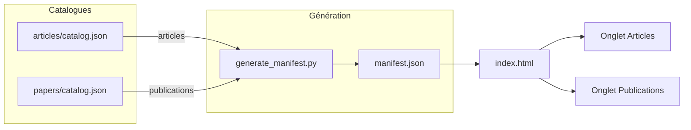
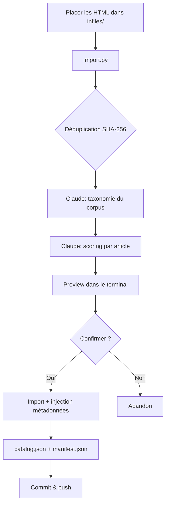
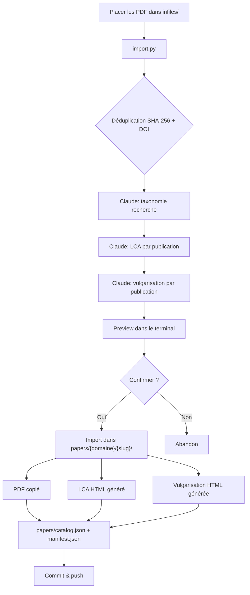
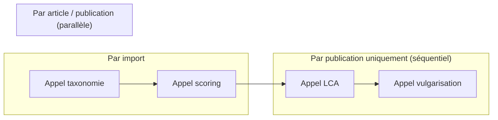
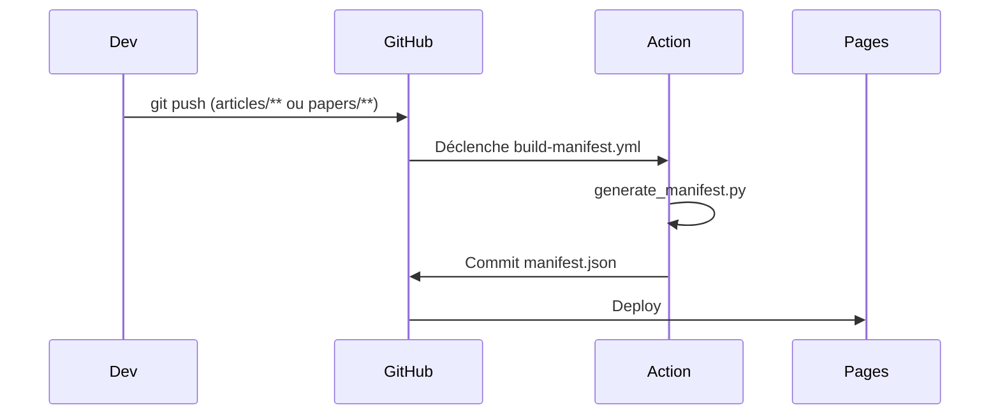

# Curax

Agrégateur d'articles IA et de publications scientifiques sur GitHub Pages. Les contenus sont classifiés automatiquement par Claude CLI avec scoring de qualité, tags et analyse transversale. Les publications PDF bénéficient d'une Lecture Critique d'Article (LCA) et d'un article de vulgarisation générés automatiquement.

## Architecture



1. `import.py` classifie les articles HTML et publications PDF via Claude CLI
2. `generate_manifest.py` lit les deux catalogues et produit `manifest.json`
3. La GitHub Action exécute `generate_manifest.py` à chaque push dans `articles/` ou `papers/`
4. `index.html` lit le manifeste et affiche les contenus dans deux onglets avec scores, tags et observations

Pas de framework, pas de bundler — vanilla HTML/CSS/JS et Python stdlib (+ `pdfplumber` pour les PDFs).

## Structure du projet

```
├── index.html                          # Page d'accueil (vanilla JS, onglets, theming)
├── style.css                           # Design system (6 thèmes, light/dark, responsive)
├── themes.js                           # Thèmes partagés (index.html + documents compagnons)
├── manifest.json                       # Généré automatiquement par l'Action
├── articles/
│   ├── catalog.json                    # Source de vérité articles
│   └── {domaine}/
│       └── *.html                      # Articles HTML
├── papers/
│   ├── catalog.json                    # Source de vérité publications
│   └── {domaine}/
│       └── {slug}/
│           ├── {slug}.pdf              # PDF original
│           ├── {slug}-lca.html         # Lecture Critique d'Article
│           └── {slug}-vulgarisation.html  # Vulgarisation (~2000 mots)
├── scripts/
│   └── import.py                       # Pipeline d'import unifié (HTML + PDF)
├── infiles/                            # Staging d'import temporaire (.gitignore)
└── .github/
    ├── workflows/build-manifest.yml
    └── scripts/generate_manifest.py
```

## Importer des articles HTML



1. Placez les fichiers HTML dans `infiles/`
2. `python3 scripts/import.py infiles/` — déduplication, taxonomie Claude, scoring, preview
3. Confirmez l'import (ou `--yes` pour sauter)
4. **Videz `infiles/`** — c'est un dossier de staging temporaire
5. Commit & push

## Importer des publications PDF



1. `pip install pdfplumber` (une seule fois)
2. Placez les fichiers PDF dans `infiles/`
3. `python3 scripts/import.py infiles/` — extraction texte, déduplication, LCA + vulgarisation
4. Confirmez l'import
5. **Videz `infiles/`**
6. Commit & push

### Import mixte

Si `infiles/` contient des HTML et des PDF, les deux pipelines tournent séquentiellement (articles d'abord, puis publications). Chaque pipeline utilise déjà le ThreadPoolExecutor pour la parallélisation des appels Claude.

### Documents compagnons

Chaque publication génère deux documents HTML compagnons :

| Document | Contenu | Public |
|----------|---------|--------|
| **LCA** (📋) | Analyse critique structurée en 7 sections + tableau de robustesse 8 critères (0-5) | Chercheurs, évaluateurs |
| **Vulgarisation** (📚) | Article pédagogique ~2000 mots en français, 6 sections | Professionnels tech non spécialistes |

Les compagnons héritent du thème Curax actif via `themes.js` et incluent un lien retour vers la page principale.

### Classification Claude CLI (Opus)



**Articles** : 1 appel taxonomie + 1 appel scoring par article (parallélisé)

**Publications** : 1 appel taxonomie + par paper : 1 appel LCA (métadonnées + robustesse + HTML) puis 1 appel vulgarisation (parallélisé cross-papers)

Les domaines sont gérés dynamiquement — Claude Opus décide de la classification selon la sémantique. Articles et publications ont des taxonomies séparées (catégories éditoriales vs axes de recherche).

### Flags

| Flag | Description |
|------|-------------|
| `--yes` | Sauter la confirmation |
| `--reclassify` | Reclassifier tous les articles (nouvelle taxonomie, nouveaux scores, renommage si titre change) |
| `--reclassify-papers` | Reclassifier les publications (domain, tags, quality_note ; score figé, compagnons non régénérés) |
| `--workers N` | Nombre de workers parallèles (défaut : 3) |

### Scores de qualité (/10)

**Articles** — score sémantique direct :

| Score | Signification |
|-------|--------------|
| 1-2 | Contenu vide ou promotionnel |
| 3-4 | Superficiel, peu d'insights |
| 5-6 | Correct, quelques insights |
| 7-8 | Bon contenu, actionnable, exemples de code |
| 9-10 | Excellent, tutoriel approfondi, code concret |

**Publications** — dérivé de la note globale LCA :

| Note globale /5 | Score /10 | Interprétation |
|-----------------|-----------|----------------|
| 0-1 | 0-2 | Méthodologie très faible |
| 1.5-2 | 3-4 | Limites importantes |
| 2.5-3 | 5-6 | Correct, résultats exploitables |
| 3.5-4 | 7-8 | Bonne robustesse méthodologique |
| 4.5-5 | 9-10 | Excellence scientifique |

La note globale est une appréciation indépendante de Claude, pas la moyenne des 8 critères de robustesse.

## Thèmes

6 thèmes visuels issus de [tweakcn.com](https://tweakcn.com), chacun avec variante light et dark :

| Thème | Style |
|-------|-------|
| **Portfolio** (défaut) | Tons dorés, coins arrondis |
| **MX-Brutalist** | Vert vif, bords carrés, bordures noires |
| **Sage Green** | Vert sauge, coins très arrondis |
| **2077** | Monochrome / rouge cyberpunk |
| **AstroVista** | Orange spatial, bleu secondaire |
| **Offworld** | Minimaliste, jaune pâle en dark |

Le thème et le mode (light/dark) sont persistés dans `localStorage`. Un script inline dans le `<head>` applique le thème avant le CSS pour éviter le FOUC. Les variables CSS suivent la convention shadcn/ui.

Les définitions de thèmes sont partagées via `themes.js` entre `index.html` et les documents compagnons.

## Setup GitHub Pages

1. **Settings > Pages** du repo
2. Source : **Deploy from a branch**
3. Branche : `main`, dossier : `/ (root)`
4. Le site sera accessible à `https://<user>.github.io/Curax/`

## Setup GitHub Action



L'Action est configurée dans `.github/workflows/build-manifest.yml` et nécessite les **permissions d'écriture** :

1. **Settings > Actions > General**
2. **Workflow permissions** : cochez **Read and write permissions**

L'Action se déclenche à chaque push modifiant `articles/**` ou `papers/**`. Lancement manuel possible via **Actions > Build Manifest > Run workflow**.

## Développement local

```bash
# Installer pdfplumber (pour les PDFs)
pip install pdfplumber

# Générer le manifeste
python3 .github/scripts/generate_manifest.py

# Servir les fichiers
python3 -m http.server 8000
```

Puis ouvrir `http://localhost:8000`.
