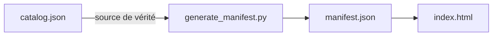
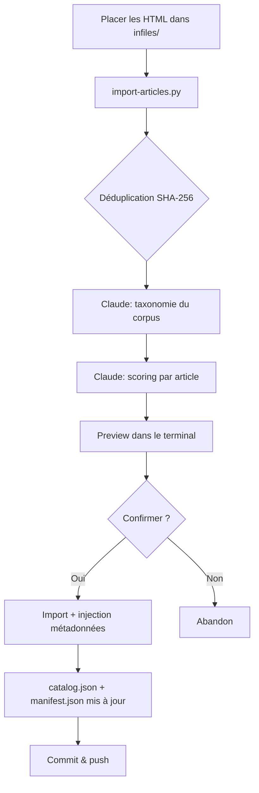
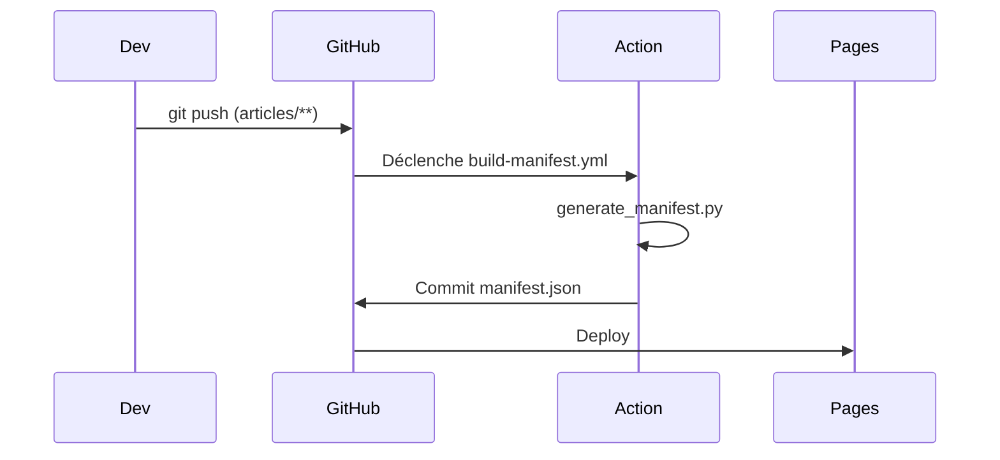

# Curax

Agrégateur d'articles IA sur GitHub Pages. Les articles sont classifiés automatiquement par Claude CLI avec scoring de qualité, tags et analyse transversale.

## Fonctionnement



1. `import-articles.py` classifie les articles via Claude CLI et maintient `articles/catalog.json`
2. `generate_manifest.py` lit `catalog.json` et produit `manifest.json`
3. La GitHub Action exécute `generate_manifest.py` à chaque push dans `articles/`
4. `index.html` lit le manifeste et affiche les articles par domaine avec scores /10, tags et observations

Pas de framework, pas de dépendance externe — vanilla HTML/CSS/JS et Python stdlib.

## Structure du projet

```
├── index.html                          # Page d'accueil (vanilla JS, theming)
├── style.css                           # Design system (6 thèmes tweakcn, light/dark)
├── manifest.json                       # Généré automatiquement par l'Action
├── articles/
│   ├── catalog.json                    # Source de vérité (domaines, métadonnées, observations)
│   └── {domaine}/
│       └── *.html                      # Articles HTML
├── scripts/
│   └── import-articles.py              # Pipeline d'import Claude-powered
├── infiles/                            # Staging d'import temporaire (.gitignore)
└── .github/
    ├── workflows/build-manifest.yml
    └── scripts/generate_manifest.py
```

## Ajouter un article



1. Placez les fichiers HTML dans `infiles/`
2. `python3 scripts/import-articles.py infiles/` — déduplication, taxonomie Claude, scoring, preview
3. Confirmez l'import (ou `--yes` pour sauter)
4. **Videz `infiles/`** après — c'est un dossier de staging temporaire
5. Commit & push

### Classification Claude CLI (Opus)

Chaque import déclenche :
- **1 appel taxonomie** : analyse du corpus + nouveaux articles, produit la taxonomie optimale des domaines et les observations transversales
- **1 appel par article** (parallélisé, 3 workers par défaut) : produit domaine, tags (1-3), score de qualité (1-10), note synthétique, titre, description

Les domaines sont gérés dynamiquement — Claude (Opus) décide de la classification selon la sémantique du contenu. Les fichiers sont nommés automatiquement d'après le titre généré par Claude.

### Flags

| Flag | Description |
|------|-------------|
| `--yes` | Sauter la confirmation |
| `--reclassify` | Reclassifier TOUS les articles existants (nouvelle taxonomie, nouveaux scores, renommage des fichiers d'après le titre Claude, déplacement si domaine change) |
| `--workers N` | Nombre de workers parallèles pour le scoring (défaut : 3) |

### Scores de qualité (/10)

| Score | Signification |
|-------|--------------|
| 1-2 | Contenu vide ou promotionnel |
| 3-4 | Superficiel, peu d'insights |
| 5-6 | Correct, quelques insights |
| 7-8 | Bon contenu, actionnable, exemples de code |
| 9-10 | Excellent, tutoriel approfondi, code concret |

## Thèmes

6 thèmes visuels issus de [tweakcn.com](https://tweakcn.com), chacun avec variante light et dark :

| Thème | Style |
|-------|-------|
| **Portfolio** (défaut) | Tons dorés, coins arrondis |
| **MX-Brutalist** | Vert vif, bords carrés, bordures noires |
| **Sage Green** | Vert sauge, coins très arrondis |
| **2077** | Monochrome / rouge cyberpunk |
| **AstroVista** | Orange spatial, bleu secondaire |
| **Offworld** | Minimaliste, jaune pâle en dark |

Le thème et le mode (light/dark) sont persistés dans `localStorage`. Un script inline dans le `<head>` applique le thème avant le CSS pour éviter le FOUC.

Les variables CSS suivent la convention shadcn/ui (`--background`, `--foreground`, `--primary`, `--card`, `--border`, etc.).

## Setup GitHub Pages

1. **Settings > Pages** du repo
2. Source : **Deploy from a branch**
3. Branche : `main`, dossier : `/ (root)`
4. Le site sera accessible à `https://<user>.github.io/Curax/`

## Setup GitHub Action



L'Action est configurée dans `.github/workflows/build-manifest.yml` et nécessite les **permissions d'écriture** :

1. **Settings > Actions > General**
2. **Workflow permissions** : cochez **Read and write permissions**

L'Action se déclenche à chaque push modifiant `articles/**`. Lancement manuel possible via **Actions > Build Manifest > Run workflow**.

## Développement local

```bash
# Générer le manifeste
python3 .github/scripts/generate_manifest.py

# Servir les fichiers
python3 -m http.server 8000
```

Puis ouvrir `http://localhost:8000`.
